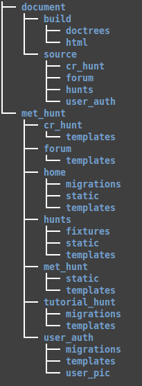
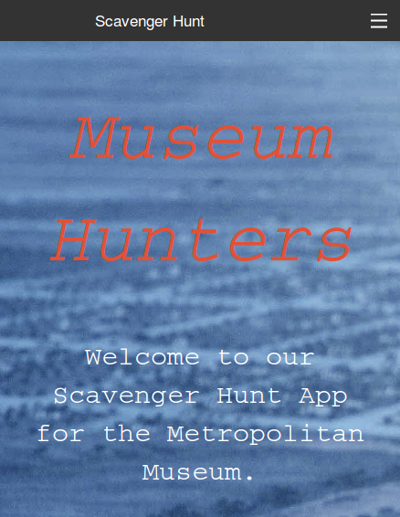
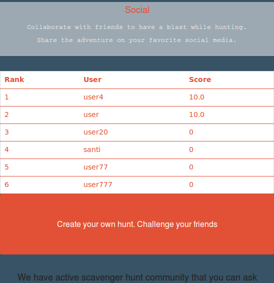
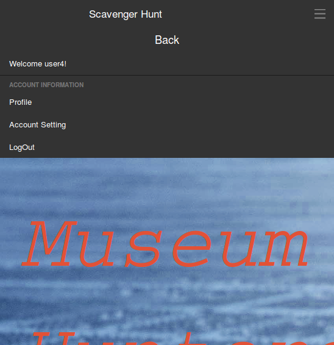
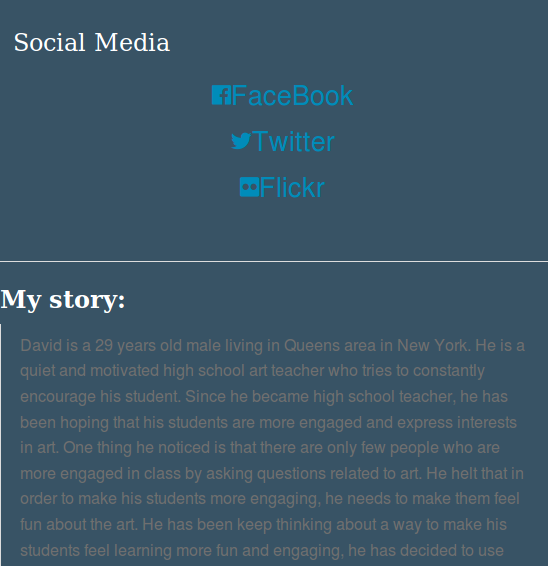
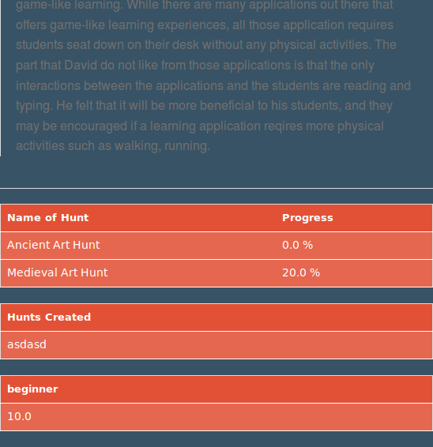
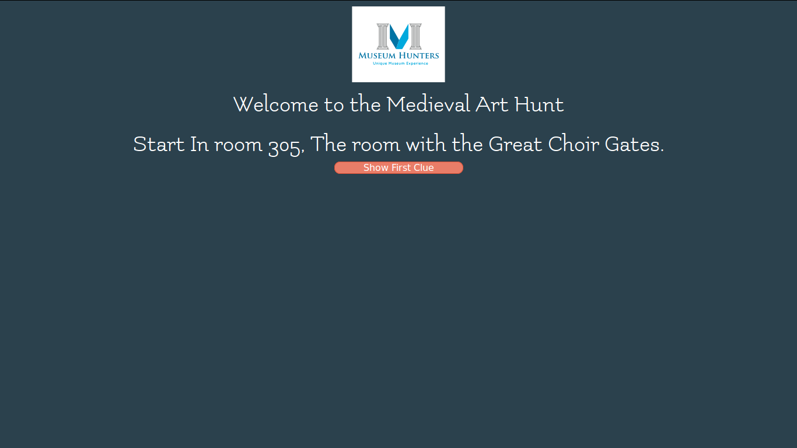
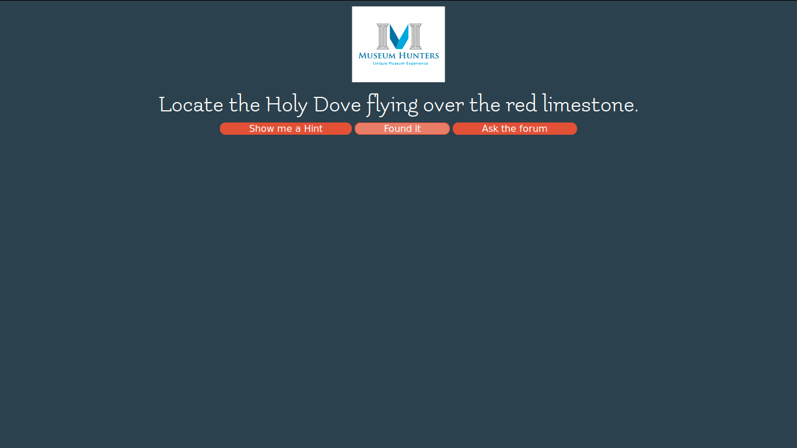
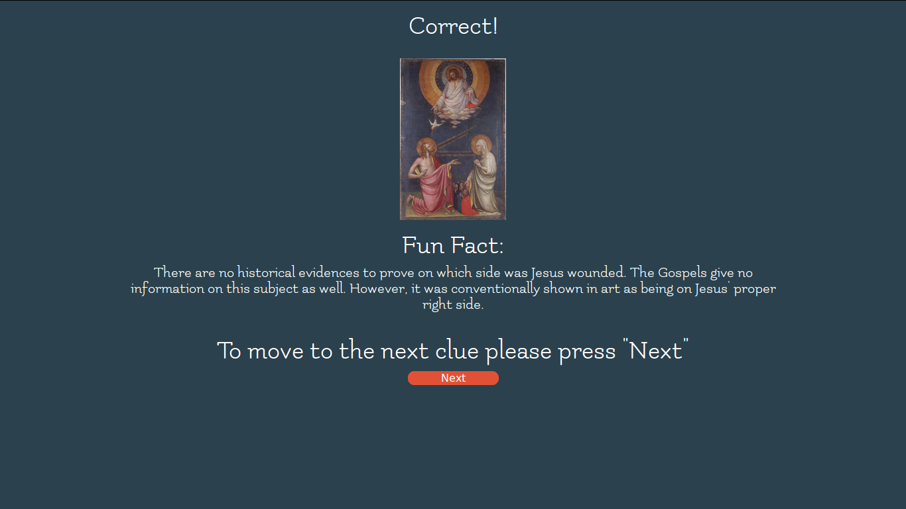

Scavenger Hunt
**************

Team Information
----------------

:Project\ Title:
	MetMuseum Scavenger Hunt

:Course\ Name:
	Web Design
	
:Team Members:
	- Moustafa Elshaabiny (Product Owner)
	- Santiago Salas (Scrum Master)
	- Edward Chung (Developer)
	- Bancroft Sparkes (Developer)
	  
Site URL
--------

http://www.slowlybutconstantly.org/scav_hunt/

Documentation URL
-----------------

http://echung00.bitbucket.org/

Directory Structure
-------------------

This is our project directory structure. The directory **document -> build -> html -> index.html** is our project documentation, and **met_hunt** is our django project. The django application **cr_hunt** is our create hunt app that lets user creates his/her own hunt, **forum** app is our Scavenger Hunt forum that all users can ask their question. **hunts** app is is responsible for our hunt game, and **user_auth** is for our site authentication. **tutorial_hunt** is our tutorial app for the hunt.

Test File
---------

Each of our application directory contains its own test file, **tests.py**. The unit tests and the integration tests are combined in **tests.py**, and to run the test file, type **python manage.py test**. Python package information that we used for our project is in **requirements.txt**. In order to run the site and tests, all python packages have to be installed.

Our acceptance test is in **met_hunt/user_auth/acceptance.py**. It uses python binding of selenium package, and all of our acceptance tests for all django application is in there.

Detailed Process of the project
-----------------------------------
For our project the first phase was to plan out how what features we were gonna implement. Aside from the boilerplate login and register, the features that we wanted to make sure made it through were: the profile page, playing a hunt from beginning to end, and storing their progress along witha  point system for users to compare against each other. 

We then had to plan how to store our data, we did this by making a database diagram. We then made it compliant with 4th normal form standards and used this model to start working on our first version of the web app. We decided to go with foundation as our framework because its mobile first development and makes our website responsive to mobile device, and because of it's flexibility. We thought in the long run that would benefit us more. We used python for our backend along with javascript and jquery for ajax calls. 

We then tried to get in touch with the Met museum, to see if they would give us access to their database but we kept on being directed to their online GUI. Our first thought was to use beautiful soup to grab the items and store it for us, but abandoned it as it would take too long. So we went to the Met to verify that the items all had ID's and then wrote out the hunts with the item info by hand.

After finishing the hunts app with the info we gained from visits, We then polished up the profile page we had, and started work on the create hunts feature. Which is something we also wanted users to have access too. After we polished up these features a little more. We decide to come up with a scoring system, which would give a competitive feeling to our app and encourage interaction between users. After deciding on how we would initially score the hunts, we then added a leaderboard on the home page along with a personal tracker on the profile page. We had the main features we wanted, but we still have plans for this app.

We hope that in the future after our app gains a little attention that the Met will reply to us and let us use their database. We also plan to implement admin features so that The created hunts can be moved to actual hunts in the app itself instead of us manually moving them in the backend. We might update the scoring system after we get a few more hunts added.

**Edward:**

    - Login, Register, (implementation and testing)
    - setting up the initial project layout
    - Forum app (implementation and testing)
    - Hunts categories page(the page that contains all our hunts according to category)
    - Search bar (implementation and testing)
    - Acceptance testing

**Moustafa:**

   - Product owner
   - Manually generated hunts info
   - Hunts app (implementation and testing)
   - Home page (formating and styling, final version)
   - Pylint cleanup (went through most of the code)
   - Website Design (including the profile page, categories page, hunts app)

**Santiago:**

   - Scrum Master
   - Created first version of tutorial hunt
   - Hunts, User_auth app(additional testing)
   - Create hunts(implementation and testing)
   - Leaderboard and score system (implementation and testing, tied in with profile page, home page and hunts app)

**Bancroft:**

   - Initial home page layout
   - Tried out competitive app so that we can add feautures that the competitive app does not have.
   - Wrote down Medieval Hunt
   - Cropped images for the hunt
   - Google map (not complete)
   - Tutorial Hunt

Some Improvements that have to be made
--------------------------------------

1. Our **tutorial_hunt** application is not complete. We focused on other core functionality for the semester. This application will be improved in the future.
2. More hunts should be added to the site.
3. The design of the hunt app will be modified.

Screen Shots
------------

