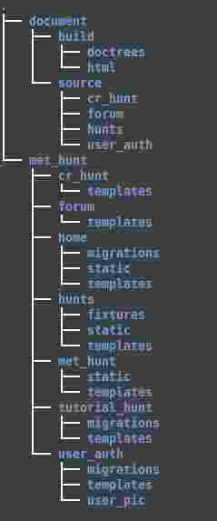

Scavenger Hunt
**************

Team Information
----------------

:Project\ Title:
	MetMuseum Scavenger Hunt

:Course\ Name:
	Web Design
	
:Team Members:
	- Moustafa Elshaabiny (Product Owner)
	- Santiago Salas (Scrum Master)
	- Edward Chung (Developer)
	- Bancroft Sparkes (Developer)
	  
Site URL
--------

http://www.slowlybutconstantly.org/scav_hunt/

Documentation URL
-----------------

http://echung00.bitbucket.org/

Directory Structure
-------------------

This is our project directory structure. The directory **document -> build -> html -> index.html** is our project documentation, and **met_hunt** is our django project. The django application **cr_hunt** is our create hunt app that lets user creates his/her own hunt, **forum** app is our Scavenger Hunt forum that all users can ask their question. **hunts** app is is responsible for our hunt game, and **user_auth** is for our site authentication. **tutorial_hunt** is our tutorial app for the hunt.

Test File
---------

Each of our application directory contains its own test file, *tests.py**. The unit tests and the integration tests are combined in **tests.py**, and to run the test file, type **python manage.py test**. Python package information that we used for our project is in **requirements.txt**. In order to run the site and tests, all python packages have to be installed.

Our acceptance test is in **met_hunt/user_auth/acceptance.py**. It uses python binding of selenium package, and all of our acceptance tests for all django application is in there.

Some Improvements that have to be made
--------------------------------------

1. Our **tutorial_hunt** application is not complete. We focused on other core functionality for the semester. This application will be improved in the future.
2. More hunts should be added to the site.
3. The design of the hunt app will be modified.
